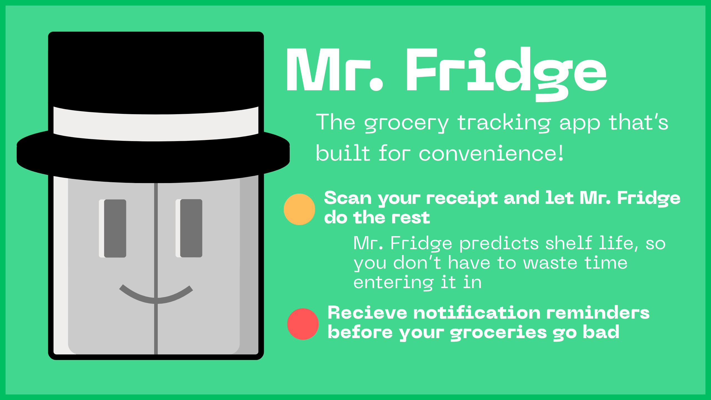
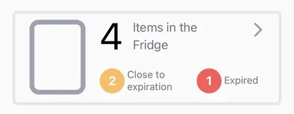
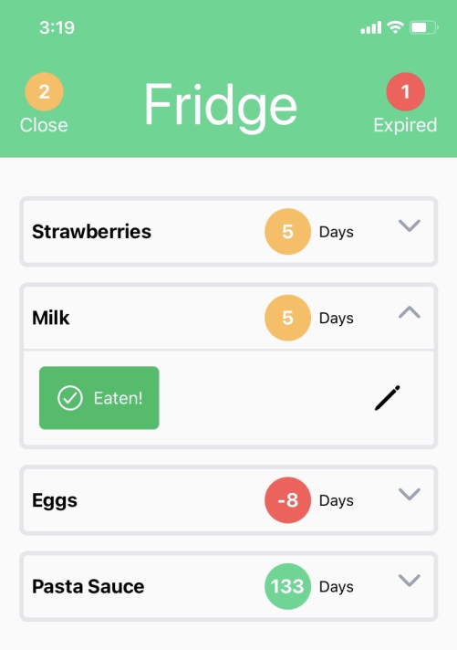
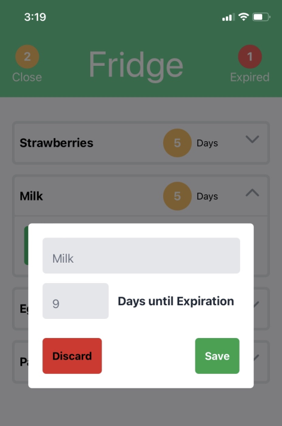
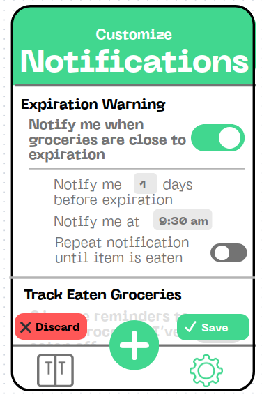

 Mr. Fridge’s is a grocery tracking app whose primary purpose is to issue notifications on items *before* they become unusable. The app will strike a balance between convenience, user-friendliness, accuracy, and notification customization, to help users reduce food waste and save money on groceries. 

 # Frontend
 The app is developed using React Native, specifically making use of the `(tabs)` file structure. The app is currently composed of two main tabs, and an additional button.
 ## 1. Groceries View
 The Groceries view displays the three sections that groceries can be stored in: **the Fridge, Pantry, and Freezer**. 

  
  
Each one gives a preview of the number of items it contains as well as how many are close to expiration or are expired.

*Screenshots from the dev version of Mr. Fridge*

  
Clicking on any of these containers will show a details panel, listing each item. From here the user has the ability to edit the name or expiration length of any item, or mark it as "eaten".

  
  

*Screenshots from the dev version of Mr. Fridge*

  

  
  ## 2. Customize Notification View

  
This view allows the user to customize the notifications they recieve from the app. The intention is to leave the user in control of how often they recieve notifications and at what time of day the notifications are issued. 

  
These notifications are sent out <strong>before</strong> the given item would go bad, giving users the forwarning they need to factor the item into their meal planning before they would have to throw it out.

  *Screenshots from the dev version of Mr. Fridge*

  

  

## 3. Center "Plus" Button
This button enables the user to add new groceries. When pressing it, the user will be given the choice to:
-  Manually enter items, great for single-item entries *or leftovers*
- Or to scan a reciept, which is great for mass entry and maximum convenience.

### Receipt Scanner
Mr. Fridge will use ocular pattern recognition to determine the products listed on the reciept, and discard non food items, such as personal hygine products. After scanning the reciept, the user will be asked to decide the storage location of each item. 

From there, an algorithm will be applied to determine the generic product type associated with each item, and the expected shelf life of the given product. 
This algorithm will be trained using data from the website [www.StillTasty.com](https://www.stilltasty.com/). It will have the flexibility to adjust predictions based on the storage location of the item (fridge, freezer, or pantry).

# Backend
Development is currently ongoing for the entirety of *Mr. Fridge*, especially the backend. Further details will be provided as they are ironed out.